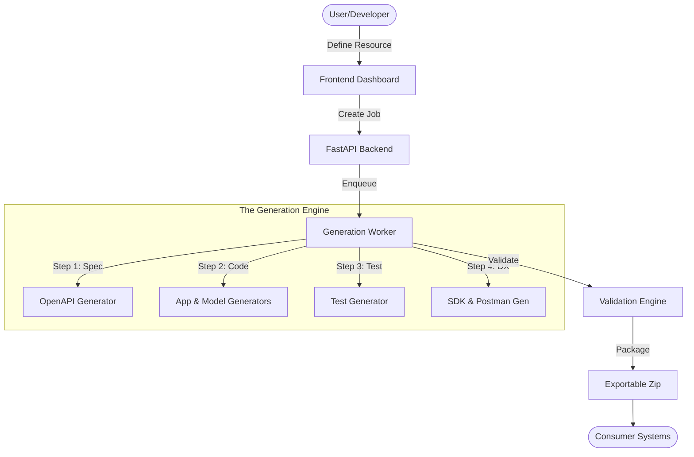

Welcome to the SynapseOps architecture overview. This project is designed as a **Microservice Factory**, automating the generation of production-ready integration systems.

## System Overview

The core value proposition of SynapseOps is the ability to turn a **Description** (Mapping Intent) into a **Production Artifact** (SDKs, API, Infra).

## Key Components

### 1. The Frontend (React/Vite)
- **Role:** Intuitive interface for resource definition.
- **Path:** `/frontend`
- **Stack:** TailwindCSS, ShadcnUI, Bun.

### 2. The Backend (FastAPI)
- **Role:** Job orchestration, state management, and API endpoints.
- **Path:** `/backend/app/main.py`
- **Patterns:** Repository pattern for DB access, Service layer for generator logic.

### 3. The Worker Pipeline (Asynchronous)
- **Role:** Executing the long-running generation tasks without blocking the user.
- **Path:** `/backend/app/worker.py`
- **Engine:** Supports Celery or local threading.

### 4. Data Mapping Engine
- **Role:** Rule-based transformation between source and target systems.
- **Path:** `backend/app/services/api_integration/services/mapping_engine.py`

## Design Philosophies

1. **Security by Design:** All generated code should be pre-scanned and follow security best practices.
2. **Observability:** Every generation step is logged and auditable.
3. **Decoupled Architecture:** Generators are independent units, making it easy to add new languages or frameworks (e.g., Go, Node.js).
